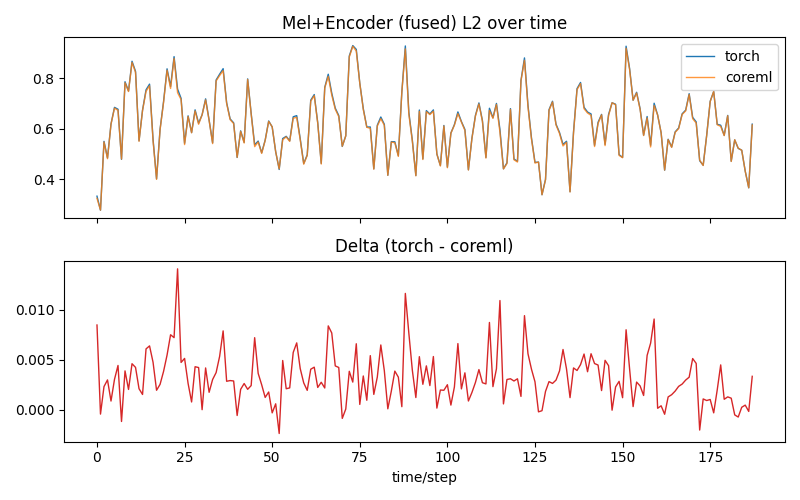
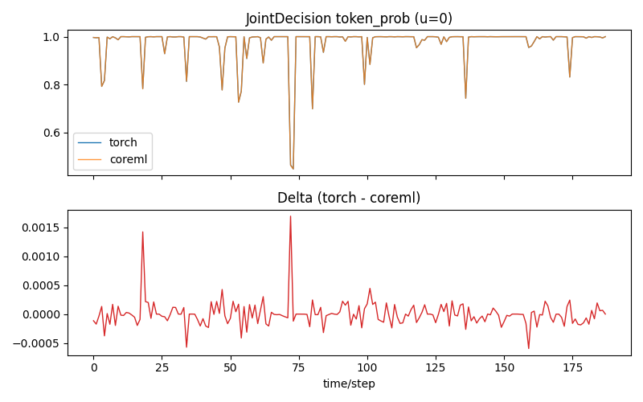
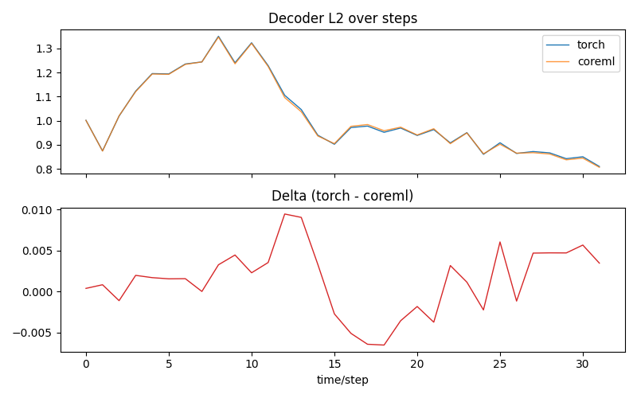
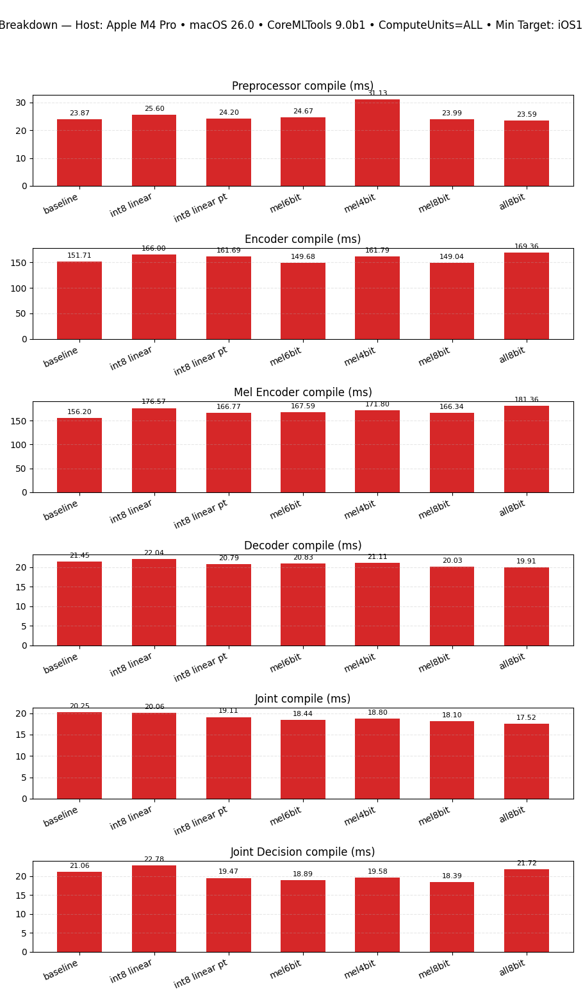
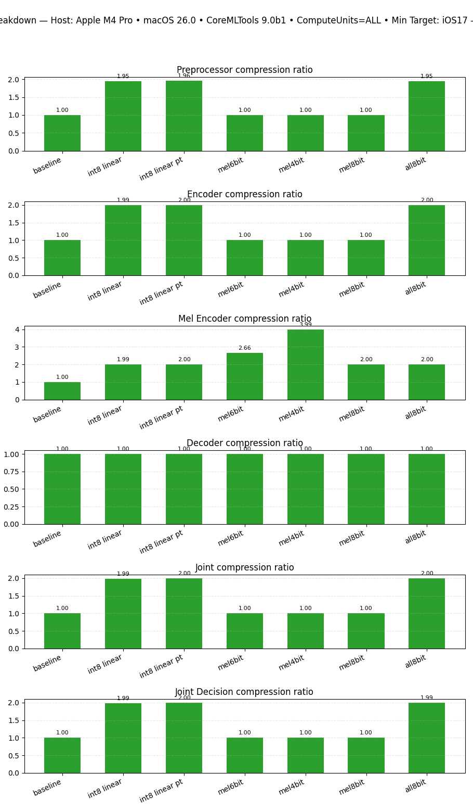
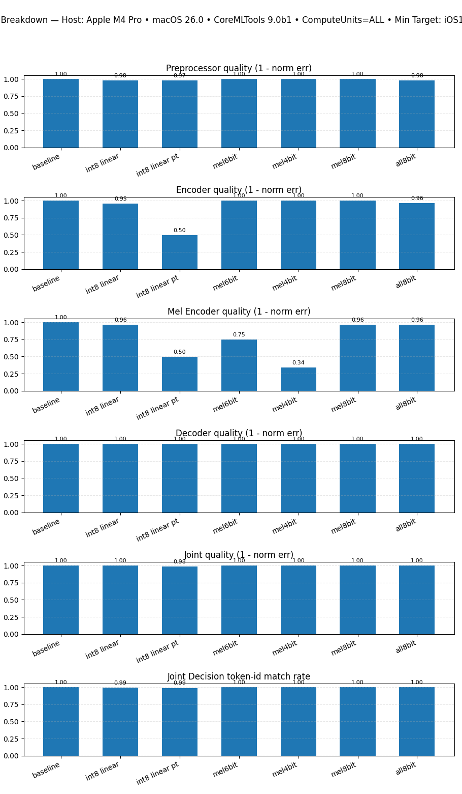
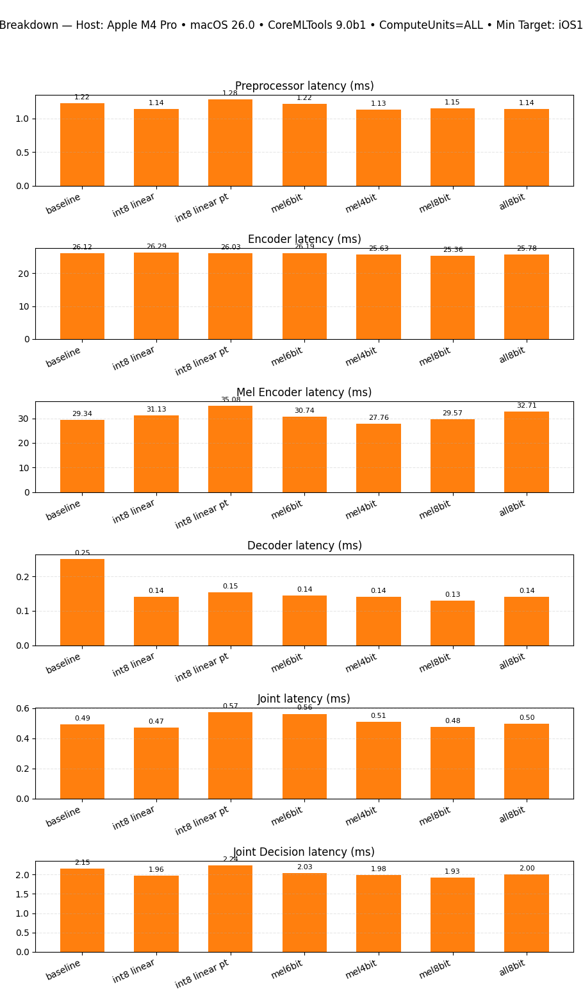

# Parakeet‑TDT v3 (0.6B) — CoreML Export, Parity, and Quantization

Tools to export NVIDIA Parakeet‑TDT v3 (0.6B) RNNT ASR to CoreML, validate numerical parity with the NeMo reference, measure latency, and explore quantization trade‑offs. All CoreML components use a fixed 15‑second audio window for export and validation.

## Environment

1. Create or reuse the local environment with `uv venv`.
2. Activate the repo `.venv` and install deps via `uv pip sync`.
3. Run everything through `uv run` to keep resolutions reproducible.

## Test Environment

All tests and measurements referenced here were run on an Apple M4 Pro with 48 GB of RAM.

## Export CoreML packages

Exports preprocessor, encoder, decoder, joint, and two fused variants (mel+encoder, joint+decision). Shapes and I/O match the fixed 15‑second window contract.

```
uv run python convert-parakeet.py convert \
  --nemo-path /path/to/parakeet-tdt-0.6b-v3.nemo \
  --output-dir parakeet_coreml
```

Notes
- Minimum deployment target: iOS 17. Export uses CPU_ONLY by default; runtime compute units can be set when loading the model (Python or Swift).
- Audio is 16 kHz, single‑channel. The 15 s window is enforced during export and validation.

## Validate parity and speed (Torch vs CoreML)

Runs Torch and CoreML side‑by‑side on the same 15 s input, records diffs and latency, and saves plots under `plots/compare-components/`. The tool updates `parakeet_coreml/metadata.json` with all measurements.

```
uv run python compare-components.py compare \
  --output-dir parakeet_coreml \
  --model-id nvidia/parakeet-tdt-0.6b-v3 \
  --runs 10 --warmup 3
```

Output comparison:





Latency:







Quants:


### Key results (quality first)

Numerical parity is strong across components on the fixed window:
- Preprocessor mel: match=true; max_abs≈0.484, max_rel≈2.00 (near‑zero bins inflate relative error).
- Encoder: match=true; max_abs≈0.0054, strong agreement over time (see plot).
- Decoder h/c state: match=true; value deltas within tolerance.
- Joint logits: match=true; max_abs≈0.099, distributions align (see top‑k plot).
- Joint+Decision: Fused CoreML head exactly matches decisions computed on CoreML logits (token_id/prob/duration). PyTorch logits produce slightly different argmax paths (expected from small logit differences).

### Speed (latency and RTF)

Component latency on a 15 s clip, Torch CPU vs CoreML (CPU+NE) from `parakeet_coreml/metadata.json`:
- Encoder: Torch 1030.48 ms → CoreML 25.44 ms (≈40.5× faster, RTF 0.00170)
- Preprocessor: 1.99 ms → 1.19 ms (≈1.68×)
- Joint: 28.34 ms → 22.66 ms (≈1.25×)
- Decoder (U=1): 7.51 ms → 4.32 ms (≈1.73×)

Fused paths:
- Mel+Encoder (Torch separate vs CoreML fused): 1032.48 ms → 27.10 ms (≈38.1× faster)
- Joint+Decision (CoreML joint + CPU post vs fused CoreML head): 50.05 ms → 64.09 ms (fused is slower here; prefer CoreML joint + lightweight CPU decision on host).

Plots
- Latency bars and speedups: `plots/compare-components/latency_summary.png`, `plots/compare-components/latency_speedup.png`
- Fused vs separate: `plots/compare-components/latency_fused_vs_separate.png`, `plots/compare-components/latency_fused_speedup.png`
- Quality visuals: mel composite (`mel_composite.png`), encoder L2 over time (`encoder_time_l2.png`), decoder step L2 (`decoder_steps_l2.png`), joint top‑k/time L2 (`joint_top50.png`, `joint_time_l2.png`), joint‑decision agreement (`joint_decision_token_agree.png`, `joint_decision_prob_u0.png`).

## Quantization (size • quality • speed)

`uv run python quantize_coreml.py` evaluates several variants and writes a roll‑up to `parakeet_coreml_quantized/quantization_summary.json`. Plots are mirrored to `plots/quantize/<compute_units>/` (we include `plots/quantize/all/`). Quality here is reported as 1 − normalized L2 error (1.0 = identical). For JointDecision we report token‑id match rate, duration match, and token‑prob MAE.

Quick highlights (ComputeUnits=ALL):
- int8 linear (per‑channel): ~2.0× smaller across components with minimal quality loss
  - MelEncoder quality≈0.963; latency≈31.13 ms (baseline≈29.34 ms)
  - JointDecision acc≈0.995; latency≈1.96 ms (baseline≈2.15 ms)
- int8 linear (per‑tensor symmetric): large encoder quality drop (≈0.50) — not recommended

Quantization plots (ALL)
- Fused: `plots/quantize/all/fused_quality.png`, `fused_latency.png`, `fused_compression.png`, `fused_size.png`
- Component breakdown: `plots/quantize/all/all_components_quality.png`, `all_components_latency.png`, `all_components_compression.png`, `all_components_size.png`, `all_components_compile.png`

## Encoder-only int4/int8 sweep

`extra_encoder_variants.py` extends the recipes in `quantize_coreml.py` with five encoder-scoped variants targeting the disk/RTFx/WER trade space. The encoder dominates the v3 model footprint, so quantizing it alone (without touching preprocessor/decoder/joint, which stay fp16) gives most of the size win without further hurting decoding quality.

Variants:

- `enc8bit-palettize` — 8-bit palette on the encoder.
- `enc-prune+int8` — sparse + int8 linear per-channel.
- `enc-int4-linear-per-channel` — int4 linear, one scale per output channel. Selected as the FluidAudio v3 default.
- `enc-int4-linear-per-block-32` — int4 linear, one scale per 32-element block.
- `enc-prune+int4-block` — sparse + int4 block-wise.

The three int4 variants explicitly bump `spec.specificationVersion = 9` (iOS18 / macOS 15) after the optimize.coreml pass, since int4 weight payloads require the iOS18 runtime.

```
uv run python extra_encoder_variants.py run \
  --input-dir parakeet_coreml \
  --output-root parakeet_coreml_encoder_only
```

Results — 100-file LibriSpeech `test-clean` subset on M-series, baseline = pre-converted fp16 encoder:

| Variant                            | WER    | RTFx  | Encoder size |
|------------------------------------|-------:|------:|-------------:|
| baseline (fp16)                    | 2.64 % | 36.8× | 426 MB       |
| `enc-prune+int8`                   | 2.57 % | 19.8× | ~340 MB      |
| **`enc-int4-linear-per-channel`**  | 5.24 % | 49.2× | 285 MB       |
| `enc-int4-linear-per-block-32`     | 3.95 % | 15.6× | ~310 MB      |
| `enc-prune+int4-block`             | 3.95 % | 15.9× | ~300 MB      |

Per-channel int4 was chosen as the v3 default for the disk + RTFx wins. Per-block variants trade ~1.3 pt WER for ~3× slower latency due to ANE fallback on the per-block dequantize op.

Production numbers on the full LibriSpeech `test-clean` (2,620 files, M2, `.cpuAndNeuralEngine`, decoder/joint/preprocessor fp16) from FluidAudio:

| Encoder           | On-disk | Avg WER | Avg CER | Overall RTFx | Peak RAM |
|-------------------|--------:|--------:|--------:|-------------:|---------:|
| 8-bit palettized  | 425 MB  | 2.64 %  | 1.03 %  | 47.1×        | 153 MB   |
| int4 linear/ch    | 285 MB  | 3.76 %  | 1.59 %  | 43.1×        | 139 MB   |

The int8 path stays the FluidAudio default; int4 is opt-in via `ParakeetEncoderPrecision.int4` (see `FluidInference/FluidAudio#560`).

### Compute-unit sweep and ANE fallback analysis

Two companion scripts diagnose where each component runs at inference:

- `compute_unit_sweep.py` — drives `tools/coreml-cli` (no `--fallback`) across all four `MLComputeUnits` (`all`, `cpu_only`, `cpu_and_gpu`, `cpu_and_neural_engine`) per component and aggregates latency + device residency into `compute_unit_sweep.json`.
- `analyze_fallback.py` — runs `coreml-cli --fallback --json` per component, summarizes total/fallback op counts, and groups CPU-fallback ops by reason into `fallback.json`.

Both scripts auto-compile any `.mlpackage` input into `<input_dir>/.compiled/<stem>.mlmodelc` and reuse that cache.

```
uv run python compute_unit_sweep.py run --input-dir parakeet_coreml
uv run python analyze_fallback.py run --input-dir parakeet_coreml_encoder_only/enc-int4-linear-per-channel
```

These were used to confirm the per-channel int4 encoder stays resident on ANE on macOS 15 / iOS 18, which is what makes the 49.2× RTFx win possible.

## Reproduce the figures

1) Export baseline CoreML packages
```
uv run python convert-parakeet.py convert --model-id nvidia/parakeet-tdt-0.6b-v3 --output-dir parakeet_coreml
```

2) Compare Torch vs CoreML and generate parity/latency plots
```
uv run python compare-components.py compare --output-dir parakeet_coreml --runs 10 --warmup 3
```

3) Run quantization sweeps (mirrors plots into `plots/quantize/<compute_units>/`)
```
uv run python quantize_coreml.py \
  --input-dir parakeet_coreml \
  --output-root parakeet_coreml_quantized \
  --compute-units ALL --runs 10
```

Examples
- Encoder 6‑bit palette only:
  `uv run python quantize_coreml.py -c encoder-palettize`
- MelEncoder 6‑bit palette only:
  `uv run python quantize_coreml.py -c mel-palettize`
  (By default, the script derives the component whitelist from the selected
  variants. Use `-m/--component` to explicitly restrict or `-m all` to force all.)

## Notes & limits

- Fixed 15‑second window shapes are required for all CoreML exports and validations.
- Latency measurements are host‑side CoreML predictions (CPU+NE or ALL); on‑device results can differ by chip/OS.
- For streaming decode, the exported decoder uses U=1 inputs with explicit LSTM state I/O.
- Minimum deployment target is iOS 17; models are saved as MLProgram and eligible for ANE when loaded with `ComputeUnits=ALL`.

## Acknowledgements

- Parakeet‑TDT v3 model from NVIDIA NeMo (`nvidia/parakeet-tdt-0.6b-v3`).
- This directory provides export/validation utilities and plots to help the community reproduce quality and performance on Apple devices.
